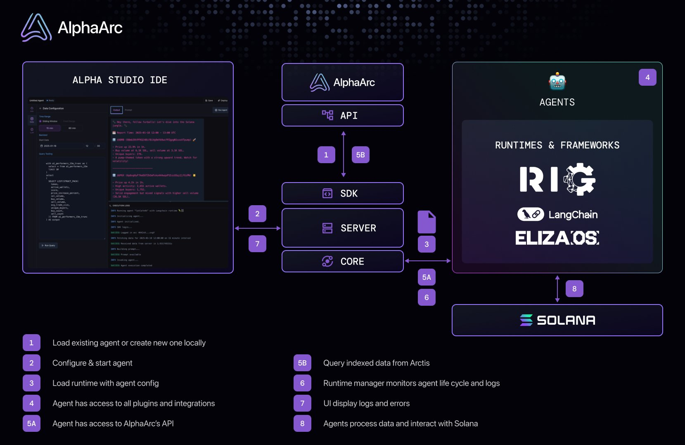

# Alpha Studio


Welcome to the **[turbo](https://turbo.build/)** monorepo for **Alpha Studio** – an integrated development environment (IDE) for building data-driven blockchain agents.  

🚧 **Project Status:**  
This project is under active development.  
- **API Stability:** Expect breaking changes as APIs evolve.  
- **Runtimes:** Currently in the proof-of-concept (POC) stage – perfect for experimentation and hacking!  

## Repository Structure & Architecture



This repository includes two main applications and several packages:  

### Applications  
- **`apps/web-ui`**:  
  A frontend application built with Vite and React.  
- **`apps/server`**:  
  A backend service to manage agent data, interact with AlphaArc's API, and run agents across various runtimes and frameworks.  

### Packages  
- **`packages/core`**:  
  Handles binary and runtime management.  
- **`packages/sdk`**:  
  A software development kit (SDK) for interacting with AlphaArc's data and agent API.  
- **`packages/langchain-runtime`**:  
  A runtime environment for running agents using [LangChain](https://www.langchain.com/).  
- **`packages/arc-runtime`**:  
  A runtime environment for running agents using [Arc/Rig](https://github.com/0xPlaygrounds/rig), a Rust-based runtime.  
- **`packages/types`**:  
  Shared TypeScript type definitions used across the project.  

---

## Installation

```bash
git clone https://github.com/AlphaArc4k/AlphaStudio.git
cd AlphaStudio
yarn
```

### Configuration

Rename `alpha.config.js.example` to `alpha.config.js`
Add API key from [account page](https://www.alphaarc.xyz/account).

#### Open AI  API key
Setting the `openAiApiKey` in the config will overwrite keys on all configurations which makes it very convenient.
**Running hosted agents locally:** For agent's loaded via API it is necessary to set the key since the API is currently not returning decrypted credentials.

Build and start all packes and apps:
```bash
yarn dev
```

UI running on `http://localhost:5173/`

### Using deepseek locally

Install [ollama](https://github.com/ollama/ollama) and start the app.

#### Manage models 
Go to `http://localhost:5173/models` to open the model manager and download deepseek if not available.

### Using Arc's Rig
Currently, the [rig runtime](https://github.com/0xPlaygrounds/rig) is not part of turbo's build pipeline.
This means you'll first have to manually build the Rust binary from `packages/arc-runtime`:
`cargo run` / `cargo build`.
Afterwards you can change the `runtime` field in `alpha.config.js` to `rig` and it should just work.

# Limitations

This is an early preview showcasing what's possible, though it currently has temporary limitations compared to running agents on the hosted version of Alpha Studio.
- changing port might not propagate to all components
- metadata enrichment API not implemented


Feel free to explore, experiment, and contribute! 🌟  
